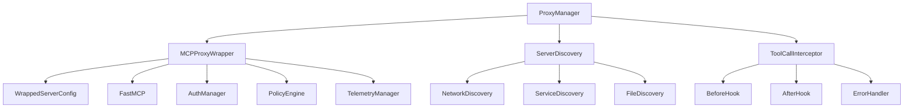

# Proxy Development Guide

This guide covers developing with the MetaMCP Proxy Wrapper, including architecture, development patterns, and best practices.

## Architecture Overview

The proxy wrapper consists of several key components:



## Core Components

### 1. ProxyManager

The main orchestrator that manages wrapped servers and provides a unified interface.

```python
from metamcp.proxy import ProxyManager

# Initialize proxy manager
proxy_manager = ProxyManager()
await proxy_manager.initialize()

# Register a server
server_id = await proxy_manager.register_server(config)

# List servers
servers = await proxy_manager.list_servers()

# Check health
health = await proxy_manager.check_health(server_id)
```

### 2. MCPProxyWrapper

The core wrapper that handles communication with wrapped MCP servers.

```python
from metamcp.proxy import MCPProxyWrapper, WrappedServerConfig

# Create wrapper
wrapper = MCPProxyWrapper()
await wrapper.initialize()

# Register server
config = WrappedServerConfig(
    name="my-server",
    endpoint="http://localhost:8001",
    transport="http"
)
server_id = await wrapper.register_server(config)
```

### 3. ServerDiscovery

Handles automatic discovery of MCP servers on the network.

```python
from metamcp.proxy import ServerDiscovery, DiscoveryConfig

# Initialize discovery
discovery = ServerDiscovery()
await discovery.initialize()

# Configure discovery
config = DiscoveryConfig(
    network_discovery=True,
    ports=[8001, 8002, 8003],
    base_urls=["http://localhost"]
)

# Discover servers
discovered = await discovery.discover_servers(config)
```

### 4. ToolCallInterceptor

Intercepts tool calls and provides hooks for customization.

```python
from metamcp.proxy import ToolCallInterceptor

# Create interceptor
interceptor = ToolCallInterceptor()

# Add before hook
@interceptor.before_hook
async def before_tool_call(tool_name: str, server_id: str, args: Dict[str, Any]):
    logger.info(f"Calling tool: {tool_name} on server: {server_id}")
    # Add custom logic here

# Add after hook
@interceptor.after_hook
async def after_tool_call(tool_name: str, server_id: str, result: Any):
    logger.info(f"Tool call completed: {tool_name}")
    # Add custom logic here
```

## Development Patterns

### 1. Custom Transport Protocol

To add support for a new transport protocol:

```python
from abc import ABC, abstractmethod
from typing import Dict, Any, List

class CustomTransport(ABC):
    """Custom transport protocol implementation."""
    
    @abstractmethod
    async def connect(self, endpoint: str) -> bool:
        """Connect to the server."""
        pass
    
    @abstractmethod
    async def get_tools(self, endpoint: str) -> List[Dict[str, Any]]:
        """Get tools from the server."""
        pass
    
    @abstractmethod
    async def call_tool(self, endpoint: str, tool_name: str, args: Dict[str, Any]) -> Any:
        """Call a tool on the server."""
        pass

class MyCustomTransport(CustomTransport):
    async def connect(self, endpoint: str) -> bool:
        # Implement connection logic
        return True
    
    async def get_tools(self, endpoint: str) -> List[Dict[str, Any]]:
        # Implement tool discovery
        return []
    
    async def call_tool(self, endpoint: str, tool_name: str, args: Dict[str, Any]) -> Any:
        # Implement tool execution
        return None
```

### 2. Custom Authentication

To implement custom authentication:

```python
from metamcp.proxy import AuthProvider

class CustomAuthProvider(AuthProvider):
    """Custom authentication provider."""
    
    async def authenticate(self, server_config: WrappedServerConfig) -> bool:
        """Authenticate with the server."""
        # Implement custom authentication logic
        return True
    
    async def get_auth_headers(self, server_config: WrappedServerConfig) -> Dict[str, str]:
        """Get authentication headers."""
        return {"Authorization": f"Bearer {server_config.auth_token}"}
```

### 3. Custom Health Check

To implement custom health checks:

```python
from metamcp.proxy import HealthChecker

class CustomHealthChecker(HealthChecker):
    """Custom health checker."""
    
    async def check_health(self, server_config: WrappedServerConfig) -> bool:
        """Check server health."""
        try:
            # Implement custom health check logic
            response = await self._make_request(server_config, "/health")
            return response.status_code == 200
        except Exception:
            return False
    
    async def get_health_details(self, server_config: WrappedServerConfig) -> Dict[str, Any]:
        """Get detailed health information."""
        return {
            "status": "healthy",
            "response_time": 0.125,
            "uptime": 3600
        }
```

### 4. Custom Tool Interceptor

To add custom tool interception logic:

```python
from metamcp.proxy import ToolCallInterceptor

class CustomToolInterceptor(ToolCallInterceptor):
    """Custom tool interceptor with additional functionality."""
    
    async def before_tool_call(self, tool_name: str, server_id: str, args: Dict[str, Any]) -> None:
        """Custom before hook."""
        # Add rate limiting
        await self._check_rate_limit(tool_name, server_id)
        
        # Add validation
        await self._validate_args(tool_name, args)
        
        # Add logging
        await self._log_tool_call(tool_name, server_id, args)
    
    async def after_tool_call(self, tool_name: str, server_id: str, result: Any) -> Any:
        """Custom after hook."""
        # Add result validation
        result = await self._validate_result(tool_name, result)
        
        # Add caching
        await self._cache_result(tool_name, server_id, result)
        
        # Add metrics
        await self._record_metrics(tool_name, server_id, result)
        
        return result
    
    async def on_error(self, tool_name: str, server_id: str, error: Exception) -> None:
        """Custom error handler."""
        # Log error
        await self._log_error(tool_name, server_id, error)
        
        # Retry logic
        await self._handle_retry(tool_name, server_id, error)
```

## Configuration Management

### 1. Server Configuration

Create a configuration class for your custom server:

```python
from dataclasses import dataclass
from typing import Optional, Dict, Any, List

@dataclass
class CustomServerConfig(WrappedServerConfig):
    """Custom server configuration."""
    
    # Additional fields
    custom_field: str = ""
    custom_timeout: int = 60
    custom_retries: int = 5
    
    # Custom validation
    def validate(self) -> None:
        """Validate configuration."""
        if not self.name:
            raise ValueError("Server name is required")
        
        if not self.endpoint:
            raise ValueError("Server endpoint is required")
        
        if self.custom_timeout <= 0:
            raise ValueError("Custom timeout must be positive")
```

### 2. Environment Configuration

Configure the proxy wrapper using environment variables:

```python
import os
from metamcp.config import get_settings

# Environment variables
os.environ["PROXY_ENABLED"] = "true"
os.environ["DISCOVERY_ENABLED"] = "true"
os.environ["HEALTH_CHECK_INTERVAL"] = "30"
os.environ["MAX_RETRY_ATTEMPTS"] = "3"

# Get settings
settings = get_settings()
```

### 3. Configuration Files

Use configuration files for complex setups:

```yaml
# config/proxy.yaml
proxy:
  enabled: true
  discovery:
    enabled: true
    network_discovery: true
    ports: [8001, 8002, 8003]
    base_urls: ["http://localhost"]
  
  health_check:
    interval: 30
    timeout: 5
    max_failures: 3
  
  security:
    auth_required: false
    security_level: "medium"
  
  servers:
    - name: "file-server"
      endpoint: "http://localhost:8001"
      transport: "http"
      categories: ["file-operations"]
    
    - name: "data-server"
      endpoint: "http://localhost:8002"
      transport: "http"
      categories: ["data-processing"]
```

## Testing

### 1. Unit Tests

Test individual components:

```python
import pytest
from unittest.mock import AsyncMock, patch
from metamcp.proxy import ProxyManager, WrappedServerConfig

class TestProxyManager:
    @pytest.fixture
    async def proxy_manager(self):
        """Create proxy manager for testing."""
        manager = ProxyManager()
        await manager.initialize()
        return manager
    
    @pytest.fixture
    def server_config(self):
        """Create test server configuration."""
        return WrappedServerConfig(
            name="test-server",
            endpoint="http://localhost:8001",
            transport="http"
        )
    
    async def test_register_server(self, proxy_manager, server_config):
        """Test server registration."""
        server_id = await proxy_manager.register_server(server_config)
        assert server_id is not None
        
        servers = await proxy_manager.list_servers()
        assert len(servers) == 1
        assert servers[0].name == "test-server"
    
    async def test_health_check(self, proxy_manager, server_config):
        """Test health check."""
        server_id = await proxy_manager.register_server(server_config)
        
        with patch('httpx.AsyncClient.get') as mock_get:
            mock_get.return_value.status_code = 200
            
            health = await proxy_manager.check_health(server_id)
            assert health.healthy is True
    
    async def test_tool_execution(self, proxy_manager, server_config):
        """Test tool execution."""
        server_id = await proxy_manager.register_server(server_config)
        
        with patch('httpx.AsyncClient.post') as mock_post:
            mock_post.return_value.json.return_value = {"result": "success"}
            mock_post.return_value.status_code = 200
            
            result = await proxy_manager.call_tool("test_tool", {"arg": "value"})
            assert result == "success"
```

### 2. Integration Tests

Test the complete proxy wrapper:

```python
import pytest
import asyncio
from httpx import AsyncClient
from metamcp.main import app

class TestProxyIntegration:
    @pytest.fixture
    async def client(self):
        """Create test client."""
        async with AsyncClient(app=app, base_url="http://test") as client:
            yield client
    
    async def test_register_server_api(self, client):
        """Test server registration via API."""
        response = await client.post("/proxy/servers", json={
            "name": "test-server",
            "endpoint": "http://localhost:8001",
            "transport": "http"
        })
        
        assert response.status_code == 200
        data = response.json()
        assert "server_id" in data["data"]
    
    async def test_health_check_api(self, client):
        """Test health check via API."""
        response = await client.get("/proxy/health")
        
        assert response.status_code == 200
        data = response.json()
        assert "data" in data
    
    async def test_discovery_api(self, client):
        """Test server discovery via API."""
        response = await client.post("/proxy/discovery", json={
            "network_discovery": True,
            "ports": [8001, 8002]
        })
        
        assert response.status_code == 200
        data = response.json()
        assert "discovered_count" in data["data"]
```

### 3. Mock Server

Create a mock MCP server for testing:

```python
import asyncio
from fastapi import FastAPI
from fastmcp import FastMCP

class MockMCPServer:
    """Mock MCP server for testing."""
    
    def __init__(self, port: int = 8001):
        self.port = port
        self.app = FastAPI()
        self.fastmcp = FastMCP(name="mock-server", version="1.0.0")
        
        # Register mock tools
        self.fastmcp.tool(
            "mock_tool",
            {
                "type": "object",
                "properties": {
                    "input": {"type": "string"}
                },
                "required": ["input"]
            },
            self._mock_tool_handler
        )
        
        # Mount FastMCP
        self.app.mount("/", self.fastmcp.app)
    
    async def _mock_tool_handler(self, args: Dict[str, Any]) -> List[str]:
        """Mock tool handler."""
        return [f"Mock result: {args.get('input', '')}"]
    
    async def start(self):
        """Start the mock server."""
        import uvicorn
        config = uvicorn.Config(self.app, host="0.0.0.0", port=self.port)
        server = uvicorn.Server(config)
        await server.serve()
    
    async def stop(self):
        """Stop the mock server."""
        # Implementation depends on server type
        pass

# Usage in tests
@pytest.fixture
async def mock_server():
    """Create mock server for testing."""
    server = MockMCPServer(port=8001)
    task = asyncio.create_task(server.start())
    yield server
    task.cancel()
    await server.stop()
```

## Performance Optimization

### 1. Connection Pooling

Implement connection pooling for better performance:

```python
import httpx
from typing import Dict

class ConnectionPool:
    """Connection pool for HTTP clients."""
    
    def __init__(self):
        self.clients: Dict[str, httpx.AsyncClient] = {}
    
    async def get_client(self, endpoint: str) -> httpx.AsyncClient:
        """Get or create HTTP client for endpoint."""
        if endpoint not in self.clients:
            self.clients[endpoint] = httpx.AsyncClient(
                base_url=endpoint,
                timeout=30.0,
                limits=httpx.Limits(max_connections=10, max_keepalive_connections=5)
            )
        
        return self.clients[endpoint]
    
    async def close_all(self):
        """Close all clients."""
        for client in self.clients.values():
            await client.aclose()
        self.clients.clear()
```

### 2. Caching

Implement caching for tool results:

```python
import asyncio
from typing import Any, Dict, Optional
from datetime import datetime, timedelta

class ToolCache:
    """Cache for tool results."""
    
    def __init__(self, ttl: int = 300):
        self.cache: Dict[str, Any] = {}
        self.ttl = ttl
    
    def _get_cache_key(self, tool_name: str, args: Dict[str, Any]) -> str:
        """Generate cache key."""
        import hashlib
        import json
        
        key_data = {
            "tool": tool_name,
            "args": sorted(args.items())
        }
        key_str = json.dumps(key_data, sort_keys=True)
        return hashlib.md5(key_str.encode()).hexdigest()
    
    def get(self, tool_name: str, args: Dict[str, Any]) -> Optional[Any]:
        """Get cached result."""
        key = self._get_cache_key(tool_name, args)
        
        if key in self.cache:
            cached = self.cache[key]
            if datetime.now() < cached["expires"]:
                return cached["result"]
            else:
                del self.cache[key]
        
        return None
    
    def set(self, tool_name: str, args: Dict[str, Any], result: Any):
        """Set cached result."""
        key = self._get_cache_key(tool_name, args)
        self.cache[key] = {
            "result": result,
            "expires": datetime.now() + timedelta(seconds=self.ttl)
        }
    
    def clear(self):
        """Clear cache."""
        self.cache.clear()
```

### 3. Load Balancing

Implement load balancing for multiple servers:

```python
import random
from typing import List, Optional
from dataclasses import dataclass

@dataclass
class ServerInfo:
    """Server information for load balancing."""
    server_id: str
    endpoint: str
    health_score: float
    load: float
    last_used: datetime

class LoadBalancer:
    """Load balancer for multiple servers."""
    
    def __init__(self):
        self.servers: List[ServerInfo] = []
    
    def add_server(self, server_id: str, endpoint: str):
        """Add server to load balancer."""
        server_info = ServerInfo(
            server_id=server_id,
            endpoint=endpoint,
            health_score=1.0,
            load=0.0,
            last_used=datetime.now()
        )
        self.servers.append(server_info)
    
    def select_server(self, strategy: str = "round_robin") -> Optional[str]:
        """Select server based on strategy."""
        if not self.servers:
            return None
        
        if strategy == "round_robin":
            return self._round_robin()
        elif strategy == "least_loaded":
            return self._least_loaded()
        elif strategy == "health_based":
            return self._health_based()
        else:
            return self._random()
    
    def _round_robin(self) -> str:
        """Round-robin selection."""
        server = min(self.servers, key=lambda s: s.last_used)
        server.last_used = datetime.now()
        return server.server_id
    
    def _least_loaded(self) -> str:
        """Least loaded selection."""
        return min(self.servers, key=lambda s: s.load).server_id
    
    def _health_based(self) -> str:
        """Health-based selection."""
        healthy_servers = [s for s in self.servers if s.health_score > 0.5]
        if healthy_servers:
            return max(healthy_servers, key=lambda s: s.health_score).server_id
        return None
    
    def _random(self) -> str:
        """Random selection."""
        return random.choice(self.servers).server_id
    
    def update_health(self, server_id: str, health_score: float):
        """Update server health score."""
        for server in self.servers:
            if server.server_id == server_id:
                server.health_score = health_score
                break
    
    def update_load(self, server_id: str, load: float):
        """Update server load."""
        for server in self.servers:
            if server.server_id == server_id:
                server.load = load
                break
```

## Error Handling

### 1. Retry Logic

Implement robust retry logic:

```python
import asyncio
from typing import Callable, Any, Optional
from functools import wraps

class RetryHandler:
    """Retry handler for failed operations."""
    
    def __init__(self, max_retries: int = 3, base_delay: float = 1.0):
        self.max_retries = max_retries
        self.base_delay = base_delay
    
    async def retry(
        self,
        operation: Callable,
        *args,
        retry_exceptions: tuple = (Exception,),
        **kwargs
    ) -> Any:
        """Retry operation with exponential backoff."""
        last_exception = None
        
        for attempt in range(self.max_retries + 1):
            try:
                return await operation(*args, **kwargs)
            except retry_exceptions as e:
                last_exception = e
                
                if attempt == self.max_retries:
                    raise last_exception
                
                # Exponential backoff
                delay = self.base_delay * (2 ** attempt)
                await asyncio.sleep(delay)
        
        raise last_exception

# Usage
retry_handler = RetryHandler(max_retries=3)

@retry_handler.retry
async def call_tool_with_retry(tool_name: str, args: Dict[str, Any]) -> Any:
    """Call tool with retry logic."""
    # Tool call implementation
    pass
```

### 2. Circuit Breaker

Implement circuit breaker pattern:

```python
from enum import Enum
from datetime import datetime, timedelta
from typing import Callable, Any

class CircuitState(Enum):
    CLOSED = "closed"
    OPEN = "open"
    HALF_OPEN = "half_open"

class CircuitBreaker:
    """Circuit breaker for fault tolerance."""
    
    def __init__(
        self,
        failure_threshold: int = 5,
        recovery_timeout: int = 60,
        expected_exception: type = Exception
    ):
        self.failure_threshold = failure_threshold
        self.recovery_timeout = recovery_timeout
        self.expected_exception = expected_exception
        
        self.state = CircuitState.CLOSED
        self.failure_count = 0
        self.last_failure_time = None
    
    async def call(self, operation: Callable, *args, **kwargs) -> Any:
        """Call operation with circuit breaker."""
        if self.state == CircuitState.OPEN:
            if self._should_attempt_reset():
                self.state = CircuitState.HALF_OPEN
            else:
                raise Exception("Circuit breaker is open")
        
        try:
            result = await operation(*args, **kwargs)
            self._on_success()
            return result
        except self.expected_exception as e:
            self._on_failure()
            raise e
    
    def _on_success(self):
        """Handle successful operation."""
        self.failure_count = 0
        self.state = CircuitState.CLOSED
    
    def _on_failure(self):
        """Handle failed operation."""
        self.failure_count += 1
        self.last_failure_time = datetime.now()
        
        if self.failure_count >= self.failure_threshold:
            self.state = CircuitState.OPEN
    
    def _should_attempt_reset(self) -> bool:
        """Check if circuit breaker should attempt reset."""
        if self.last_failure_time is None:
            return True
        
        return datetime.now() - self.last_failure_time > timedelta(seconds=self.recovery_timeout)
```

## Monitoring and Observability

### 1. Custom Metrics

Implement custom metrics:

```python
from dataclasses import dataclass
from datetime import datetime
from typing import Dict, List

@dataclass
class ProxyMetrics:
    """Proxy wrapper metrics."""
    
    # Server metrics
    total_servers: int = 0
    healthy_servers: int = 0
    unhealthy_servers: int = 0
    
    # Tool metrics
    total_tools: int = 0
    tool_calls: int = 0
    successful_calls: int = 0
    failed_calls: int = 0
    
    # Performance metrics
    avg_response_time: float = 0.0
    max_response_time: float = 0.0
    min_response_time: float = float('inf')
    
    # Discovery metrics
    discovery_runs: int = 0
    discovered_servers: int = 0
    auto_registered: int = 0

class MetricsCollector:
    """Collect and track metrics."""
    
    def __init__(self):
        self.metrics = ProxyMetrics()
        self.response_times: List[float] = []
    
    def record_tool_call(self, success: bool, response_time: float):
        """Record tool call metrics."""
        self.metrics.tool_calls += 1
        
        if success:
            self.metrics.successful_calls += 1
        else:
            self.metrics.failed_calls += 1
        
        self.response_times.append(response_time)
        self._update_response_time_metrics()
    
    def record_server_health(self, total: int, healthy: int):
        """Record server health metrics."""
        self.metrics.total_servers = total
        self.metrics.healthy_servers = healthy
        self.metrics.unhealthy_servers = total - healthy
    
    def record_discovery(self, discovered: int, auto_registered: int):
        """Record discovery metrics."""
        self.metrics.discovery_runs += 1
        self.metrics.discovered_servers += discovered
        self.metrics.auto_registered += auto_registered
    
    def _update_response_time_metrics(self):
        """Update response time metrics."""
        if self.response_times:
            self.metrics.avg_response_time = sum(self.response_times) / len(self.response_times)
            self.metrics.max_response_time = max(self.response_times)
            self.metrics.min_response_time = min(self.response_times)
    
    def get_metrics(self) -> ProxyMetrics:
        """Get current metrics."""
        return self.metrics
    
    def reset_metrics(self):
        """Reset metrics."""
        self.metrics = ProxyMetrics()
        self.response_times.clear()
```

### 2. Structured Logging

Implement structured logging:

```python
import logging
import json
from datetime import datetime
from typing import Dict, Any

class StructuredLogger:
    """Structured logger for proxy wrapper."""
    
    def __init__(self, name: str = "metamcp.proxy"):
        self.logger = logging.getLogger(name)
        self.logger.setLevel(logging.INFO)
    
    def log_server_event(self, event: str, server_id: str, details: Dict[str, Any] = None):
        """Log server-related event."""
        log_data = {
            "timestamp": datetime.now().isoformat(),
            "event": event,
            "server_id": server_id,
            "details": details or {}
        }
        
        self.logger.info(json.dumps(log_data))
    
    def log_tool_call(self, tool_name: str, server_id: str, args: Dict[str, Any], success: bool, response_time: float):
        """Log tool call."""
        log_data = {
            "timestamp": datetime.now().isoformat(),
            "event": "tool_call",
            "tool_name": tool_name,
            "server_id": server_id,
            "args": args,
            "success": success,
            "response_time": response_time
        }
        
        self.logger.info(json.dumps(log_data))
    
    def log_discovery_event(self, event: str, discovered_count: int, details: Dict[str, Any] = None):
        """Log discovery event."""
        log_data = {
            "timestamp": datetime.now().isoformat(),
            "event": event,
            "discovered_count": discovered_count,
            "details": details or {}
        }
        
        self.logger.info(json.dumps(log_data))
    
    def log_error(self, error: Exception, context: Dict[str, Any] = None):
        """Log error."""
        log_data = {
            "timestamp": datetime.now().isoformat(),
            "event": "error",
            "error_type": type(error).__name__,
            "error_message": str(error),
            "context": context or {}
        }
        
        self.logger.error(json.dumps(log_data))
```

## Best Practices

### 1. Error Handling

- Always handle exceptions gracefully
- Implement retry logic for transient failures
- Use circuit breakers for fault tolerance
- Log errors with sufficient context

### 2. Performance

- Use connection pooling for HTTP clients
- Implement caching for frequently accessed data
- Use load balancing for multiple servers
- Monitor and optimize response times

### 3. Security

- Validate all inputs
- Implement proper authentication
- Use HTTPS for sensitive communications
- Audit all operations

### 4. Monitoring

- Collect comprehensive metrics
- Use structured logging
- Implement health checks
- Set up alerts for critical failures

### 5. Testing

- Write comprehensive unit tests
- Use integration tests for end-to-end validation
- Mock external dependencies
- Test error conditions

This comprehensive development guide covers all aspects of working with the MetaMCP Proxy Wrapper, from basic usage to advanced customization and optimization. 