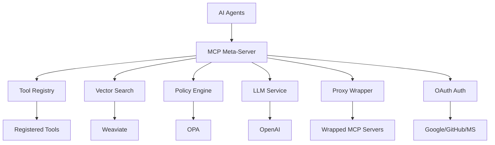

# MetaMCP Documentation

Welcome to the MetaMCP documentation! MetaMCP is a dynamic MCP Meta-Server that acts as an intelligent proxy and tool registry for AI agents.

## What is MetaMCP?

MetaMCP is an open-source MCP (Model Context Protocol) Meta-Server that provides:

- **Dynamic Tool Discovery**: AI agents can describe tasks and receive the most suitable tools
- **Semantic Search**: Tool selection using vector embeddings and similarity matching
- **Proxy Wrapper**: Wrap arbitrary MCP servers with enhanced features
- **Security & Policies**: Role-based access control and audit logging
- **Enterprise Features**: OPA integration, monitoring, and admin UI

## Quick Start

```bash
# Clone the repository
git clone https://github.com/lichtbaer/MetaMCP.git
cd MetaMCP

# Create virtual environment
python3 -m venv venv
source venv/bin/activate

# Install dependencies
pip install -r requirements.txt
pip install -r requirements-dev.txt

# Start the development server
python -m metamcp.main

# Access the admin UI
open http://localhost:8000
```

## Architecture



## Key Features

### 🔧 Core Features
- **MCP Protocol Compatibility**: Full implementation of the Model Context Protocol
- **Tool Registry**: Dynamic management of tools with metadata and descriptions
- **Semantic Search**: AI-based tool selection using vector embeddings
- **Proxy & Orchestration**: Intelligent routing of agent requests to appropriate tools

### 🔄 Proxy Wrapper Features
- **Server Wrapping**: Wrap arbitrary MCP servers with enhanced features
- **Transport Support**: HTTP, WebSocket, and stdio transport protocols
- **Server Discovery**: Automatic discovery of MCP servers on the network
- **Health Monitoring**: Continuous health checks and status monitoring
- **Load Balancing**: Intelligent routing and load distribution
- **Authentication**: Proxy-level authentication for wrapped servers

### 🛡️ Enterprise Features
- **Policy Engine**: OPA integration for granular access control
- **Audit Logging**: Complete request tracking and compliance
- **Admin UI**: Web interface for tool and server management
- **OpenAPI Integration**: Automatic tool import from Swagger specs

### 🔐 Security Features
- **OAuth Integration**: Multi-provider authentication (Google, GitHub, Microsoft)
- **JWT Tokens**: Secure session management
- **Role-based Access**: Fine-grained permissions
- **Audit Trail**: Complete activity logging

### 🚀 Advanced Features
- **OpenAI Integration**: Embeddings and text generation
- **Vector Database**: Weaviate integration for semantic search
- **Monitoring**: Prometheus metrics and Grafana dashboards
- **OpenTelemetry**: Distributed tracing and observability
- **Docker Support**: Complete containerization with Docker Compose

## Getting Started

1. **[Quick Start](getting-started/quick-start.md)** - Get up and running in minutes
2. **[Proxy Quick Start](getting-started/proxy-quick-start.md)** - Using the proxy wrapper

## User Guide

- **[API Reference](user-guide/api-reference.md)** - REST API documentation
- **[Proxy Wrapper](user-guide/proxy-wrapper.md)** - Using the proxy wrapper functionality
- **[Security](user-guide/security.md)** - Security features and best practices

## Developer Guide

- **[Development Setup](developer-guide/development-setup.md)** - Setting up development environment
- **[Code Structure](developer-guide/code-structure.md)** - Understanding the codebase
- **[Architecture](developer-guide/architecture.md)** - Detailed system architecture
- **[Proxy Development](developer-guide/proxy-development.md)** - Developing with the proxy wrapper
- **[Testing](developer-guide/testing.md)** - Testing guidelines and examples

## Development

- **[Contributing](development/contributing.md)** - How to contribute to MetaMCP

## API & Integration

- **[API Documentation](api/index.md)** - Complete API documentation
- **[OAuth Integration](oauth/fastmcp-integration.md)** - OAuth authentication for agents

## Monitoring & Operations

- **[Monitoring Overview](monitoring/index.md)** - Monitoring and observability
- **[Production Setup](monitoring/production-setup.md)** - Production deployment
- **[Telemetry](monitoring/telemetry.md)** - OpenTelemetry integration

## Reference

- **[Configuration](reference/configuration.md)** - Complete configuration reference
- **[Environment Variables](reference/environment-variables.md)** - Environment configuration
- **[Proxy API](reference/proxy-api.md)** - Proxy wrapper API documentation

## Additional Resources

- **[Composition Improvements](composition-improvements.md)** - Recent improvements
- **[Roadmap](roadmap.md)** - Future development plans

## Contributing

We welcome contributions! Please see our [Contributing Guide](https://github.com/lichtbaer/MetaMCP/blob/main/CONTRIBUTING.md) for details.

## Support

- **GitHub Issues**: [Report bugs or request features](https://github.com/lichtbaer/MetaMCP/issues)
- **Discord**: [Join our community](https://discord.gg/metamcp)
- **Documentation**: This site contains comprehensive documentation

## License

MetaMCP is licensed under the MIT License. See [LICENSE](https://github.com/lichtbaer/MetaMCP/blob/main/LICENSE) for details. 