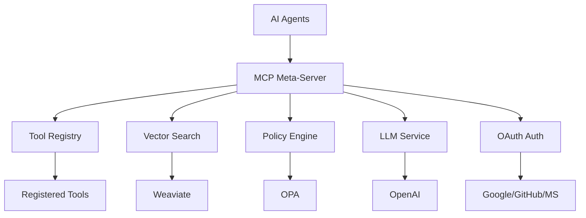

# MetaMCP Documentation

Welcome to the MetaMCP documentation! MetaMCP is a dynamic MCP Meta-Server that acts as an intelligent proxy and tool registry for AI agents.

## What is MetaMCP?

MetaMCP is an open-source MCP (Model Context Protocol) Meta-Server that provides:

- **Dynamic Tool Discovery**: AI agents can describe tasks and receive the most suitable tools
- **Semantic Search**: Tool selection using vector embeddings and similarity matching
- **Security & Policies**: Role-based access control and audit logging
- **Enterprise Features**: OPA integration, monitoring, and admin UI

## Quick Start

```bash
# Clone the repository
git clone https://github.com/lichtbaer/MetaMCP.git
cd MetaMCP

# Install dependencies
uv pip install -r requirements.txt

# Start the development server
python -m metamcp.main

# Access the admin UI
open http://localhost:8000
```

## Architecture



## Key Features

### 🔧 Core Features
- **MCP Protocol Compatibility**: Full implementation of the Model Context Protocol
- **Tool Registry**: Dynamic management of tools with metadata and descriptions
- **Semantic Search**: AI-based tool selection using vector embeddings
- **Proxy & Orchestration**: Intelligent routing of agent requests to appropriate tools

### 🛡️ Enterprise Features
- **Policy Engine**: OPA integration for granular access control
- **Audit Logging**: Complete request tracking and compliance
- **Admin UI**: Web interface for tool management
- **OpenAPI Integration**: Automatic tool import from Swagger specs

### 🔐 Security Features
- **OAuth Integration**: Multi-provider authentication (Google, GitHub, Microsoft)
- **JWT Tokens**: Secure session management
- **Role-based Access**: Fine-grained permissions
- **Audit Trail**: Complete activity logging

### 🚀 Advanced Features
- **OpenAI Integration**: Embeddings and text generation
- **Vector Database**: Weaviate integration for semantic search
- **Monitoring**: Prometheus metrics and Grafana dashboards
- **OpenTelemetry**: Distributed tracing and observability
- **Docker Support**: Complete containerization with Docker Compose

## Getting Started

1. **[Quick Start](getting-started/quick-start.md)** - Get up and running in minutes
2. **[Installation](getting-started/installation.md)** - Detailed installation instructions
3. **[Configuration](getting-started/configuration.md)** - Configure your MetaMCP instance

## User Guide

- **[Overview](user-guide/overview.md)** - Understanding MetaMCP concepts
- **[Architecture](user-guide/architecture.md)** - Detailed system architecture
- **[API Reference](user-guide/api-reference.md)** - REST API documentation
- **[MCP Protocol](user-guide/mcp-protocol.md)** - MCP protocol implementation
- **[Tool Management](user-guide/tool-management.md)** - Managing tools and capabilities
- **[Security](user-guide/security.md)** - Security features and best practices
- **[OAuth Integration](oauth/fastmcp-integration.md)** - OAuth authentication for agents

## Developer Guide

- **[Development Setup](developer-guide/development-setup.md)** - Setting up development environment
- **[Code Structure](developer-guide/code-structure.md)** - Understanding the codebase
- **[Adding Tools](developer-guide/adding-tools.md)** - How to add new tools
- **[Custom Policies](developer-guide/custom-policies.md)** - Creating custom access policies
- **[Testing](developer-guide/testing.md)** - Testing guidelines and examples

## Deployment

- **[Docker](deployment/docker.md)** - Docker deployment guide
- **[Kubernetes](deployment/kubernetes.md)** - Kubernetes deployment
- **[Production](deployment/production.md)** - Production deployment best practices
- **[Monitoring](deployment/monitoring.md)** - Monitoring and observability

## Reference

- **[Configuration](reference/configuration.md)** - Complete configuration reference
- **[API Endpoints](reference/api-endpoints.md)** - Detailed API endpoint documentation
- **[Error Codes](reference/error-codes.md)** - Error codes and troubleshooting
- **[Troubleshooting](reference/troubleshooting.md)** - Common issues and solutions

## Contributing

We welcome contributions! Please see our [Contributing Guide](https://github.com/lichtbaer/MetaMCP/blob/main/CONTRIBUTING.md) for details.

## Support

- **GitHub Issues**: [Report bugs or request features](https://github.com/lichtbaer/MetaMCP/issues)
- **Discord**: [Join our community](https://discord.gg/metamcp)
- **Documentation**: This site contains comprehensive documentation

## License

MetaMCP is licensed under the MIT License. See [LICENSE](https://github.com/lichtbaer/MetaMCP/blob/main/LICENSE) for details. 