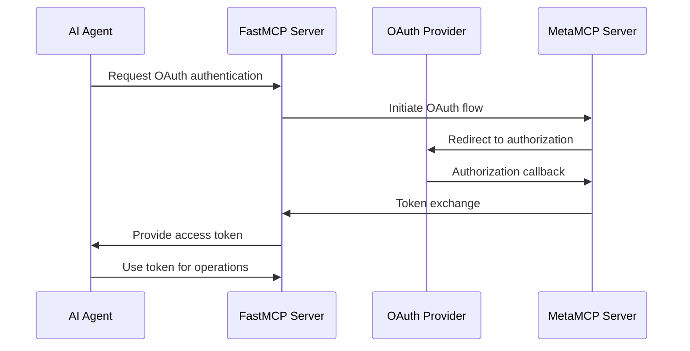

# FastMCP OAuth Integration

## Overview

MetaMCP provides comprehensive OAuth 2.0 support for AI agents using the FastMCP protocol. This enables secure authentication and authorization for autonomous AI agents, allowing them to access protected resources and services.

## Architecture

### OAuth Flow for AI Agents



## Configuration

### OAuth Provider Setup

```yaml
# MetaMCP Configuration
oauth:
  providers:
    google:
      client_id: "your-google-client-id"
      client_secret: "your-google-client-secret"
      scopes: ["openid", "email", "profile"]
    github:
      client_id: "your-github-client-id"
      client_secret: "your-github-client-secret"
      scopes: ["read:user", "repo"]
    microsoft:
      client_id: "your-microsoft-client-id"
      client_secret: "your-microsoft-client-secret"
      scopes: ["openid", "profile", "email"]

fastmcp:
  oauth_enabled: true
  agent_oauth_flow: "authorization_code"
  token_exchange_endpoint: "/oauth/token"
  agent_session_ttl: 3600
```

### Environment Variables

```bash
# Google OAuth
GOOGLE_OAUTH_CLIENT_ID=your-google-client-id
GOOGLE_OAUTH_CLIENT_SECRET=your-google-client-secret

# GitHub OAuth
GITHUB_OAUTH_CLIENT_ID=your-github-client-id
GITHUB_OAUTH_CLIENT_SECRET=your-github-client-secret

# Microsoft OAuth
MICROSOFT_OAUTH_CLIENT_ID=your-microsoft-client-id
MICROSOFT_OAUTH_CLIENT_SECRET=your-microsoft-client-secret
```

## API Endpoints

### Agent OAuth Authentication

#### Initiate OAuth Flow

```http
POST /oauth/fastmcp/agent/authenticate
Content-Type: application/json

{
  "agent_id": "agent-123",
  "provider": "google",
  "requested_scopes": ["openid", "email", "profile"]
}
```

**Response:**
```json
{
  "authorization_url": "https://accounts.google.com/oauth/authorize?...",
  "agent_id": "agent-123",
  "provider": "google",
  "flow_type": "agent_oauth"
}
```

#### Check Session Status

```http
GET /oauth/fastmcp/agent/{agent_id}/session?provider={provider}
```

**Response:**
```json
{
  "agent_id": "agent-123",
  "provider": "google",
  "authenticated": true,
  "expires_at": "2024-01-01T12:00:00Z",
  "scopes": ["openid", "email", "profile"]
}
```

#### Token Exchange

```http
POST /oauth/fastmcp/agent/{agent_id}/token
Content-Type: application/json

{
  "authorization_code": "4/0AfJohXn...",
  "state": "abc123..."
}
```

**Response:**
```json
{
  "agent_id": "agent-123",
  "provider": "google",
  "access_token": "ya29.a0AfH6SMC...",
  "token_type": "Bearer",
  "expires_at": "2024-01-01T12:00:00Z",
  "scope": "openid email profile",
  "user": {
    "provider_user_id": "123456789",
    "email": "agent@example.com",
    "name": "AI Agent"
  }
}
```

## FastMCP Integration

### Agent Authentication Flow

1. **Agent Registration**: Agent registers with FastMCP server
2. **OAuth Initiation**: Agent requests OAuth authentication
3. **Authorization**: User authorizes agent access
4. **Token Storage**: OAuth tokens stored securely
5. **Session Management**: Agent uses tokens for operations

### FastMCP Protocol Extensions

```python
# FastMCP OAuth message types
class OAuthInitiateMessage:
    agent_id: str
    provider: str
    requested_scopes: List[str]

class OAuthCallbackMessage:
    agent_id: str
    provider: str
    authorization_code: str
    state: str

class OAuthTokenMessage:
    agent_id: str
    provider: str
    access_token: str
    token_type: str
    expires_at: Optional[str]
    scope: str
```

### WebSocket Message Flow

```javascript
// Agent initiates OAuth
{
  "jsonrpc": "2.0",
  "id": 1,
  "method": "oauth/initiate",
  "params": {
    "agent_id": "agent-123",
    "provider": "google",
    "requested_scopes": ["openid", "email", "profile"]
  }
}

// Server responds with authorization URL
{
  "jsonrpc": "2.0",
  "id": 1,
  "result": {
    "authorization_url": "https://accounts.google.com/oauth/authorize?...",
    "agent_id": "agent-123",
    "provider": "google"
  }
}

// Agent provides authorization code
{
  "jsonrpc": "2.0",
  "id": 2,
  "method": "oauth/token",
  "params": {
    "agent_id": "agent-123",
    "provider": "google",
    "authorization_code": "4/0AfJohXn...",
    "state": "abc123..."
  }
}

// Server responds with token
{
  "jsonrpc": "2.0",
  "id": 2,
  "result": {
    "agent_id": "agent-123",
    "provider": "google",
    "access_token": "ya29.a0AfH6SMC...",
    "token_type": "Bearer",
    "expires_at": "2024-01-01T12:00:00Z",
    "scope": "openid email profile"
  }
}
```

## Security Considerations

### Token Security

- **Secure Storage**: OAuth tokens stored with encryption
- **Token Refresh**: Automatic token refresh before expiry
- **Scope Validation**: Validate requested scopes against allowed scopes
- **Session Isolation**: Agent sessions isolated from user sessions

### Agent Authentication

- **Agent Identity**: Unique agent ID for each agent instance
- **Provider Validation**: Validate OAuth provider configuration
- **State Management**: Secure state parameter for OAuth flows
- **Error Handling**: Comprehensive error handling and logging

### Best Practices

1. **Use HTTPS**: Always use HTTPS for OAuth communications
2. **Validate Scopes**: Only request necessary OAuth scopes
3. **Token Rotation**: Implement token rotation for long-lived agents
4. **Audit Logging**: Log all OAuth operations for security audit
5. **Error Recovery**: Implement proper error recovery mechanisms

## Implementation Examples

### Python Agent Example

```python
import asyncio
import websockets
import json

class OAuthAgent:
    def __init__(self, agent_id: str, websocket_url: str):
        self.agent_id = agent_id
        self.websocket_url = websocket_url
        self.access_token = None
    
    async def authenticate_with_oauth(self, provider: str):
        """Authenticate agent using OAuth."""
        async with websockets.connect(self.websocket_url) as websocket:
            # Initiate OAuth flow
            await websocket.send(json.dumps({
                "jsonrpc": "2.0",
                "id": 1,
                "method": "oauth/initiate",
                "params": {
                    "agent_id": self.agent_id,
                    "provider": provider,
                    "requested_scopes": ["openid", "email", "profile"]
                }
            }))
            
            # Get authorization URL
            response = await websocket.recv()
            result = json.loads(response)["result"]
            auth_url = result["authorization_url"]
            
            print(f"Please visit: {auth_url}")
            
            # Wait for user to complete authorization
            auth_code = input("Enter authorization code: ")
            state = input("Enter state parameter: ")
            
            # Exchange code for token
            await websocket.send(json.dumps({
                "jsonrpc": "2.0",
                "id": 2,
                "method": "oauth/token",
                "params": {
                    "agent_id": self.agent_id,
                    "provider": provider,
                    "authorization_code": auth_code,
                    "state": state
                }
            }))
            
            # Get access token
            response = await websocket.recv()
            result = json.loads(response)["result"]
            self.access_token = result["access_token"]
            
            print(f"Authentication successful for agent {self.agent_id}")
    
    async def use_authenticated_service(self):
        """Use authenticated service with OAuth token."""
        if not self.access_token:
            raise ValueError("Agent not authenticated")
        
        # Use access token for API calls
        headers = {"Authorization": f"Bearer {self.access_token}"}
        # Make authenticated requests...

# Usage
async def main():
    agent = OAuthAgent("agent-123", "ws://localhost:8000/mcp/ws")
    await agent.authenticate_with_oauth("google")
    await agent.use_authenticated_service()

asyncio.run(main())
```

### JavaScript Agent Example

```javascript
class OAuthAgent {
    constructor(agentId, websocketUrl) {
        this.agentId = agentId;
        this.websocketUrl = websocketUrl;
        this.accessToken = null;
    }
    
    async authenticateWithOAuth(provider) {
        const ws = new WebSocket(this.websocketUrl);
        
        return new Promise((resolve, reject) => {
            ws.onopen = async () => {
                // Initiate OAuth flow
                const initiateMessage = {
                    jsonrpc: "2.0",
                    id: 1,
                    method: "oauth/initiate",
                    params: {
                        agent_id: this.agentId,
                        provider: provider,
                        requested_scopes: ["openid", "email", "profile"]
                    }
                };
                
                ws.send(JSON.stringify(initiateMessage));
            };
            
            ws.onmessage = async (event) => {
                const response = JSON.parse(event.data);
                
                if (response.id === 1) {
                    // Got authorization URL
                    const authUrl = response.result.authorization_url;
                    console.log(`Please visit: ${authUrl}`);
                    
                    // In a real implementation, you'd handle the OAuth flow
                    // For demo purposes, we'll simulate the callback
                    const authCode = prompt("Enter authorization code:");
                    const state = prompt("Enter state parameter:");
                    
                    // Exchange code for token
                    const tokenMessage = {
                        jsonrpc: "2.0",
                        id: 2,
                        method: "oauth/token",
                        params: {
                            agent_id: this.agentId,
                            provider: provider,
                            authorization_code: authCode,
                            state: state
                        }
                    };
                    
                    ws.send(JSON.stringify(tokenMessage));
                } else if (response.id === 2) {
                    // Got access token
                    this.accessToken = response.result.access_token;
                    console.log(`Authentication successful for agent ${this.agentId}`);
                    ws.close();
                    resolve();
                }
            };
            
            ws.onerror = (error) => {
                reject(error);
            };
        });
    }
    
    async useAuthenticatedService() {
        if (!this.accessToken) {
            throw new Error("Agent not authenticated");
        }
        
        // Use access token for API calls
        const headers = { Authorization: `Bearer ${this.accessToken}` };
        // Make authenticated requests...
    }
}

// Usage
const agent = new OAuthAgent("agent-123", "ws://localhost:8000/mcp/ws");
await agent.authenticateWithOAuth("google");
await agent.useAuthenticatedService();
```

## Monitoring and Observability

### OAuth Metrics

```python
# OAuth-specific metrics
oauth_authentication_attempts = Counter(
    "oauth_authentication_attempts_total",
    "Total OAuth authentication attempts",
    ["provider", "agent_id", "status"]
)

oauth_token_refreshes = Counter(
    "oauth_token_refreshes_total",
    "Total OAuth token refreshes",
    ["provider", "agent_id"]
)

oauth_session_duration = Histogram(
    "oauth_session_duration_seconds",
    "OAuth session duration",
    ["provider", "agent_id"]
)
```

### Logging

```python
# OAuth event logging
logger.info("OAuth authentication initiated", extra={
    "agent_id": agent_id,
    "provider": provider,
    "requested_scopes": requested_scopes
})

logger.info("OAuth authentication completed", extra={
    "agent_id": agent_id,
    "provider": provider,
    "user_id": oauth_user.provider_user_id,
    "scopes": oauth_user.scopes
})
```

## Troubleshooting

### Common Issues

1. **Invalid OAuth Configuration**
   - Check client ID and secret
   - Verify redirect URI configuration
   - Ensure provider is enabled

2. **Token Expiry**
   - Implement automatic token refresh
   - Handle refresh token expiry
   - Re-authenticate when needed

3. **Scope Issues**
   - Validate requested scopes
   - Check provider scope support
   - Handle scope rejection

4. **Network Issues**
   - Implement retry logic
   - Handle timeout scenarios
   - Log network errors

### Debug Mode

Enable debug logging for OAuth operations:

```yaml
logging:
  level: DEBUG
  oauth_debug: true
```

This will provide detailed logs for OAuth flow debugging.

## Future Enhancements

### Planned Features

1. **Multi-Provider Support**: Support for multiple OAuth providers per agent
2. **Token Delegation**: Allow agents to delegate tokens to other services
3. **Advanced Scopes**: Dynamic scope management based on agent capabilities
4. **OAuth 2.1**: Support for OAuth 2.1 security enhancements
5. **PKCE Support**: Proof Key for Code Exchange for enhanced security

### Integration Roadmap

- **Q2 2024**: Basic OAuth support for agents
- **Q3 2024**: Multi-provider and advanced scopes
- **Q4 2024**: Token delegation and OAuth 2.1
- **Q1 2025**: Advanced security features and PKCE 