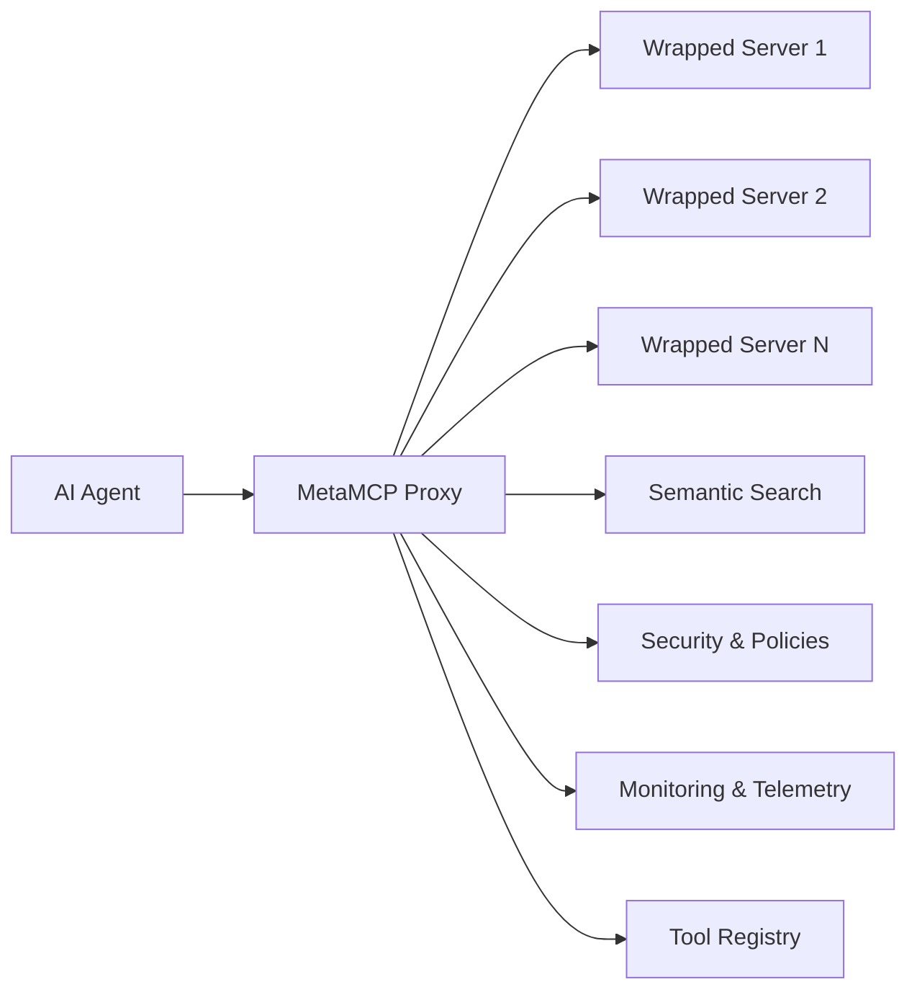

# Proxy Wrapper

The MetaMCP Proxy Wrapper allows you to wrap arbitrary MCP servers and enhance them with MetaMCP's advanced features like semantic search, security, monitoring, and policy enforcement.

## Overview

The proxy wrapper acts as an intermediary between AI agents and MCP servers, providing:

- **Transparent Wrapping**: Wrap existing MCP servers without modification
- **Enhanced Features**: Add semantic search, security, and monitoring
- **Transport Flexibility**: Support HTTP, WebSocket, and stdio transports
- **Server Discovery**: Automatically discover MCP servers on your network
- **Health Monitoring**: Continuous health checks and status tracking

## Architecture



## Getting Started

### 1. Register a Server

You can register MCP servers via the REST API:

```bash
curl -X POST http://localhost:8000/proxy/servers \
  -H "Content-Type: application/json" \
  -d '{
    "name": "my-mcp-server",
    "endpoint": "http://localhost:8001",
    "transport": "http",
    "auth_required": false,
    "timeout": 30,
    "retry_attempts": 3,
    "security_level": "medium",
    "categories": ["file-operations", "data-processing"],
    "description": "A custom MCP server for file operations"
  }'
```

### 2. List Registered Servers

```bash
curl http://localhost:8000/proxy/servers
```

### 3. Check Server Health

```bash
curl http://localhost:8000/proxy/health
```

## Server Configuration

### WrappedServerConfig

The proxy wrapper uses a configuration object to define how servers should be wrapped:

```python
from metamcp.proxy import WrappedServerConfig

config = WrappedServerConfig(
    name="my-server",
    endpoint="http://localhost:8001",
    transport="http",  # http, websocket, stdio
    auth_required=False,
    auth_token=None,
    timeout=30,
    retry_attempts=3,
    security_level="medium",  # low, medium, high
    categories=["file-operations"],
    description="My custom MCP server",
    metadata={"version": "1.0.0"}
)
```

### Configuration Options

| Option | Type | Default | Description |
|--------|------|---------|-------------|
| `name` | str | Required | Server name |
| `endpoint` | str | Required | Server endpoint URL |
| `transport` | str | "http" | Transport protocol (http, websocket, stdio) |
| `auth_required` | bool | False | Whether authentication is required |
| `auth_token` | str | None | Authentication token |
| `timeout` | int | 30 | Request timeout in seconds |
| `retry_attempts` | int | 3 | Number of retry attempts |
| `security_level` | str | "medium" | Security level (low, medium, high) |
| `categories` | List[str] | [] | Tool categories |
| `description` | str | "" | Server description |
| `metadata` | Dict | {} | Additional metadata |

## Transport Protocols

### HTTP Transport

For HTTP-based MCP servers:

```python
config = WrappedServerConfig(
    name="http-server",
    endpoint="http://localhost:8001",
    transport="http",
    timeout=30
)
```

### WebSocket Transport

For WebSocket-based MCP servers:

```python
config = WrappedServerConfig(
    name="websocket-server",
    endpoint="ws://localhost:8002",
    transport="websocket",
    timeout=30
)
```

### stdio Transport

For stdio-based MCP servers:

```python
config = WrappedServerConfig(
    name="stdio-server",
    endpoint="/path/to/server/executable",
    transport="stdio",
    timeout=30
)
```

## Server Discovery

The proxy wrapper includes automatic server discovery capabilities:

### 1. Network Discovery

Scan for MCP servers on your network:

```bash
curl -X POST http://localhost:8000/proxy/discovery \
  -H "Content-Type: application/json" \
  -d '{
    "network_discovery": true,
    "ports": [8001, 8002, 8003, 8004, 8005],
    "base_urls": ["http://localhost", "http://127.0.0.1"],
    "timeout": 5
  }'
```

### 2. Service Discovery

Discover servers via service discovery:

```bash
curl -X POST http://localhost:8000/proxy/discovery \
  -H "Content-Type: application/json" \
  -d '{
    "service_discovery": true,
    "service_endpoints": ["http://consul:8500", "http://etcd:2379"],
    "timeout": 5
  }'
```

### 3. File Discovery

Discover servers from configuration files:

```bash
curl -X POST http://localhost:8000/proxy/discovery \
  -H "Content-Type: application/json" \
  -d '{
    "file_discovery": true,
    "config_paths": ["./mcp-servers.json", "./config/mcp-servers.json"],
    "timeout": 5
  }'
```

## Health Monitoring

The proxy wrapper continuously monitors the health of wrapped servers:

### Health Check Endpoint

```bash
curl http://localhost:8000/proxy/health
```

Response:
```json
{
  "server_1": {
    "server_id": "server_1",
    "status": "healthy",
    "last_seen": "2024-01-15T10:30:00Z",
    "healthy": true,
    "error": null
  },
  "server_2": {
    "server_id": "server_2",
    "status": "unhealthy",
    "last_seen": "2024-01-15T10:25:00Z",
    "healthy": false,
    "error": "Connection timeout"
  }
}
```

### Health Check Configuration

Health checks are performed automatically with configurable intervals:

```python
# Health check settings
health_check_interval = 30  # seconds
health_check_timeout = 5    # seconds
max_failures = 3           # consecutive failures before marking unhealthy
```

## Security Features

### Authentication

For servers requiring authentication:

```python
config = WrappedServerConfig(
    name="secure-server",
    endpoint="http://localhost:8001",
    transport="http",
    auth_required=True,
    auth_token="your-auth-token"
)
```

### Security Levels

Different security levels provide varying levels of protection:

- **Low**: Basic validation and logging
- **Medium**: Enhanced validation, rate limiting, and audit logging
- **High**: Strict validation, encryption, and comprehensive audit logging

## Tool Interception

The proxy wrapper intercepts tool calls and provides enhanced functionality:

### Before Tool Call

```python
async def before_tool_call(tool_name: str, server_id: str, args: Dict[str, Any]):
    # Log the tool call
    logger.info(f"Tool call: {tool_name} on server {server_id}")
    
    # Apply security policies
    if not await policy_engine.check_access(tool_name, args):
        raise AccessDeniedError("Access denied")
    
    # Add telemetry
    await telemetry_manager.record_tool_call(tool_name, server_id)
```

### After Tool Call

```python
async def after_tool_call(tool_name: str, server_id: str, result: Any):
    # Log the result
    logger.info(f"Tool call completed: {tool_name}")
    
    # Add telemetry
    await telemetry_manager.record_tool_result(tool_name, server_id, result)
    
    # Apply post-processing
    return await post_process_result(result)
```

## Error Handling

The proxy wrapper provides comprehensive error handling:

### Connection Errors

```python
try:
    await proxy_wrapper.register_server(config)
except ProxyError as e:
    logger.error(f"Failed to register server: {e}")
    # Handle connection errors
```

### Tool Execution Errors

```python
try:
    result = await proxy_wrapper.call_tool("tool_name", args)
except ToolExecutionError as e:
    logger.error(f"Tool execution failed: {e}")
    # Handle tool execution errors
```

### Health Check Errors

```python
health_status = await proxy_wrapper.check_health(server_id)
if not health_status.healthy:
    logger.warning(f"Server {server_id} is unhealthy: {health_status.error}")
    # Handle unhealthy server
```

## Monitoring and Telemetry

### Metrics

The proxy wrapper provides various metrics:

- **Server Health**: Uptime, response time, error rates
- **Tool Usage**: Call frequency, success rates, execution time
- **Network**: Connection status, latency, throughput
- **Security**: Authentication attempts, policy violations

### Logging

Comprehensive logging is available:

```python
# Enable debug logging
logging.getLogger("metamcp.proxy").setLevel(logging.DEBUG)

# Log server registration
logger.info(f"Registered server: {server_id}")

# Log tool calls
logger.info(f"Tool call: {tool_name} -> {server_id}")

# Log errors
logger.error(f"Server {server_id} is unhealthy: {error}")
```

## Best Practices

### 1. Server Registration

- Use descriptive names for servers
- Set appropriate timeouts based on server capabilities
- Configure security levels based on server sensitivity
- Add meaningful categories for better tool discovery

### 2. Health Monitoring

- Set reasonable health check intervals
- Monitor error rates and response times
- Implement automatic recovery for failed servers
- Use alerts for critical server failures

### 3. Security

- Use authentication for sensitive servers
- Configure appropriate security levels
- Monitor for policy violations
- Regularly audit server access

### 4. Performance

- Use appropriate retry strategies
- Monitor tool execution times
- Implement caching where appropriate
- Balance load across multiple servers

## Troubleshooting

### Common Issues

1. **Server Connection Failed**
   - Check server endpoint and port
   - Verify network connectivity
   - Check firewall settings

2. **Authentication Errors**
   - Verify auth token is correct
   - Check token expiration
   - Ensure auth_required is set correctly

3. **Tool Execution Timeouts**
   - Increase timeout settings
   - Check server performance
   - Consider server load

4. **Health Check Failures**
   - Verify server is running
   - Check health endpoint
   - Review server logs

### Debug Mode

Enable debug logging for troubleshooting:

```python
import logging
logging.getLogger("metamcp.proxy").setLevel(logging.DEBUG)
```

### Health Check Debugging

```bash
# Check specific server health
curl http://localhost:8000/proxy/servers/{server_id}

# Check all servers
curl http://localhost:8000/proxy/health

# View server logs
docker logs metamcp-proxy
```

## API Reference

For complete API documentation, see [Proxy API Reference](../reference/proxy-api.md).

## Examples

### Python Client Example

```python
import asyncio
from metamcp.proxy import ProxyManager, WrappedServerConfig

async def main():
    # Initialize proxy manager
    proxy_manager = ProxyManager()
    await proxy_manager.initialize()
    
    # Register a server
    config = WrappedServerConfig(
        name="file-server",
        endpoint="http://localhost:8001",
        transport="http",
        categories=["file-operations"]
    )
    
    server_id = await proxy_manager.register_server(config)
    print(f"Registered server: {server_id}")
    
    # List servers
    servers = await proxy_manager.list_servers()
    for server in servers:
        print(f"Server: {server.name} - {server.status}")
    
    # Check health
    health = await proxy_manager.check_health(server_id)
    print(f"Health: {health.healthy}")

asyncio.run(main())
```

### Docker Compose Example

```yaml
version: '3.8'
services:
  metamcp:
    image: metamcp:latest
    ports:
      - "8000:8000"
    environment:
      - PROXY_ENABLED=true
      - DISCOVERY_ENABLED=true
    volumes:
      - ./config:/app/config
```

This comprehensive guide covers all aspects of using the MetaMCP Proxy Wrapper to enhance arbitrary MCP servers with advanced features. 